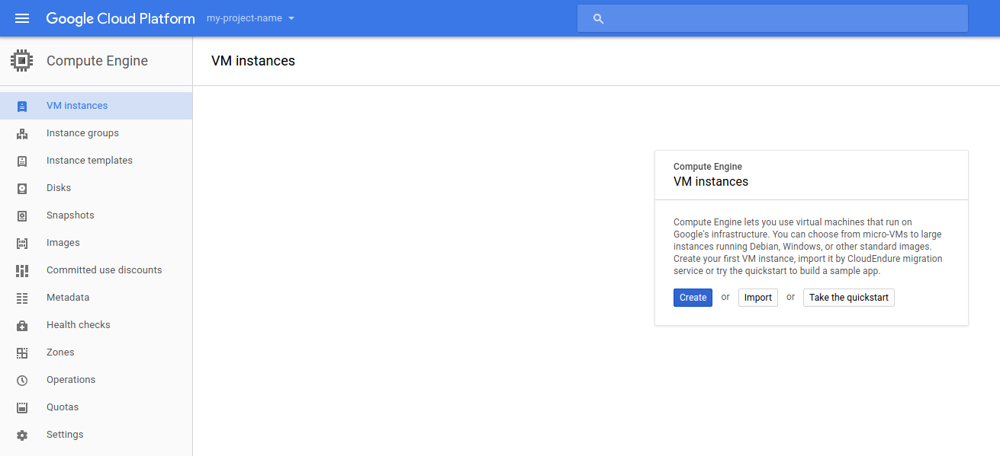
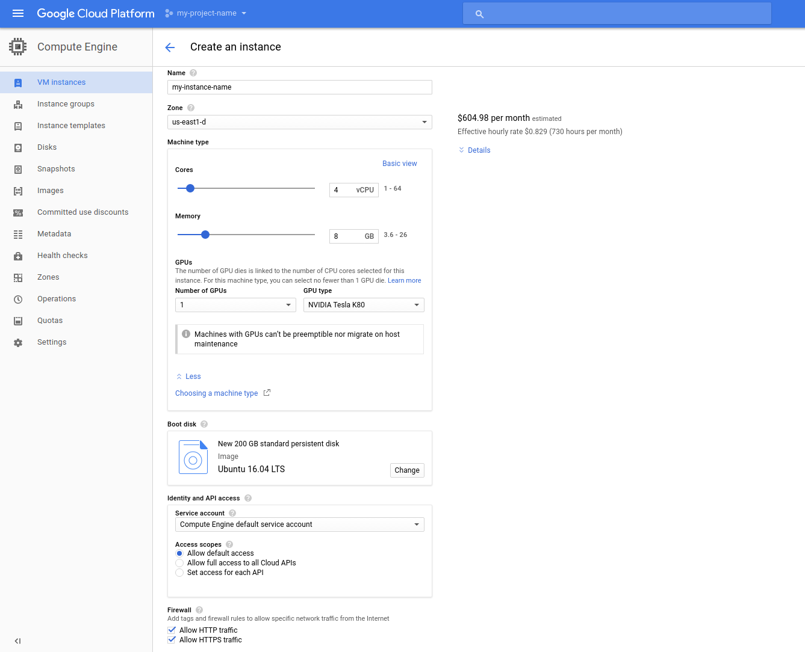
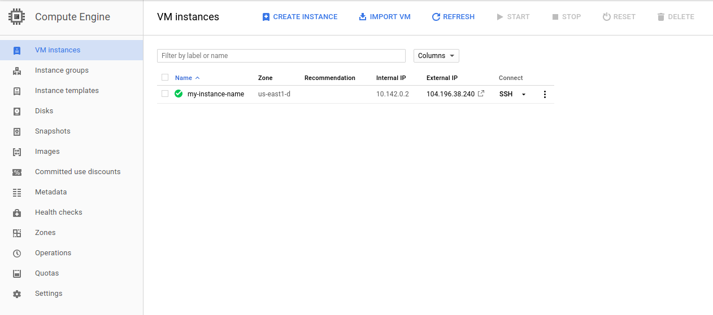
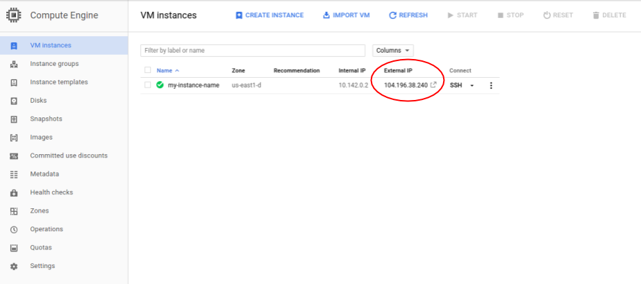

# What is Google Cloud
Google Cloud is a clout computing platform that offers hosting on the same supporting
infrastructure that is used internally at Google. In addition to hosting, Google Cloud
provides a suite of services useful for developers such as cloud storage, dats storage,
computer vision API's, translation API's, and many other tools. Two tools of particular
use for deep learning are Google Cloud's compute engine and Cloud ML service. 

# Who should use it
Google Cloud does provide valuable cloud compute services but for deep learning,
having your own GPU(s) will always be more cost effective. But for those of
you who cannot afford one right now but still want to dabble in deep learning 
or maybe even just use it for a [Kaggle Competition]() then Google Cloud is a 
great temporary service.

# Setting up a Virtual Machine for Deep Learning
Though it is possible to run machine learning and deep learning jobs on
[Google Cloud ML Engine](https://cloud.google.com/ml-engine/), it is often
easier to have a virtual machine with GPU capability. With a virtual machine
you can simply ssh onto your virtual instance and have a full Ubuntu(or any 
other OS you choose) machine that can run your code and scripts. It is also
very easy to set this up in Google Cloud.

I will now give a brief walkthrough of setting up a 4 core machine with 8GB 
of RAM, 1 NVIDIA K80, and 200GB of storage space. 

# Step 0: Register for Google Cloud
If you have not already, sign up for Google Cloud on the [homepage](https://cloud.google.com/).

# Step 1: Create your instance
After clicking the menu in the top left and navigating to "Compute Engine" you should be greeted with 
the following 



Click "Create" and you should then be greeted with a menu similar to the following



It is in this menu that you can configure all of the details of your instance. You can either choose a pre-defined instance type or choose the amount of CPU cores, RAM, number of GPU's, and storage manually. The above setup is suitable for most deep
learning tasks so we will stick with that. Since I will be using Tensorflow and other libraries primiarly supported by Ubuntu, I will be using that as my OS but this is also something you can configure.

Once you are done configuring your instance scrool down and press create. After some initial setup time you should be greeted 
by the following screen.



From here you can turn off your instance, delete it, or connect to it via ssh. It is possible to use your own ssh client 
to connect to your instance but the built in Gcloud ssh client works just as well and has
some useful features. Once you have connected you can begin the setup of the software on
the instance

# Step 2: Installing CUDA
In order to take advatake of the K80 GPU you have on your instance you will need CUDA
installed on your system. You can download the appropriate CUDA installer for your system
[here](https://developer.nvidia.com/cuda-downloads). If on Ubuntu then downloading the debian 
installer is the easiest to work with. If you are install via the .deb file you can follow the 
steps below

``` 
sudo dpkg -i cuda-repo-ubuntu-version.deb
sudo apt-get update
sudo apt-get upgrade -y
```
# Step 3: Installing Tensorflow and Keras
[Tensorflow](https://www.tensorflow.org/) is a popular machine learning and deep learning framework
which allows deployment of your models on almost any system. [Keras](https://keras.io/) is a wrapper
for Tensorflow and Thenao which simplifies the syntax of Tensorflow and makes deep learning overall,
more accesible. Tensorflow is usually preferred for more complex models but for many simple use cases
Keras allows you to get going with experimentation quickly.

We first will install some dependencies

```
sudo apt-get install python-pip python-dev build-essential
sudo pip install numpy
sudo pip install scipy
```

There are multiple ways to isntall Tensorflow and all of them can be found on their very well 
documented [website](https://www.tensorflow.org/install/). If you do not need all of the bells
and whistles but just need the basic working version of Tensorflow you can actually use Ubuntu's
package manager.

```
sudo pip install tensorflow-gpu
```

Keras also has a few dependencies you will also need to install before installing 

```
sudo pip install pyyaml 
sudo pip install h5py
sudo pip install keras
```

And that's it! You can now run some examples from the Tensorflow or Keras code bases to confirm 
your install is correct. Do make sure to stop your instance when you are done using it as you
will be charged by the minute. I have added a script that performs all of the installation I 
have done above so that you can simply copy the script to your new instance and install everything
you need.


# Using Jupyter on Google Cloud
[Jupyter](http://jupyter.org/) is an excelent tool for data science in general as it provides
a easy to use notebook format for coding in your browser. It is great for quick experimentation,
visualizations, and interactive data science. If you are using or wish to use Jupyter on
Google Cloud it is actually extremely easy!

## Step 1: Install Jupyter
You can easily install Jupyter with pip

```
sudo pip install jupyter
```

## Step 2: Start Jupyter Server Side
Since Jupyter notebooks run in your browser you will need to first start the server on your
virtual machine before connecting on your local machine. On your virtual machine simply run
the following command 

```
jupyter notebook --ip=0.0.0.0 --port=8888 --no-browser
```

## Step 3: Connect to Your Notebook Server
Once you have run that command you should  see URL to connect to in your terminal 
of the form *http://0.0.0.0:8888/?token=%%%%%*. On your local machine you should go to that
link but replace *0.0.0.0* with the external IP address of your virtual instance.
You can find your external IP address on the compute engine VM instances page and is 
shown in the below screenshot.



From there you can start up a new notebook and begin your experimentation!